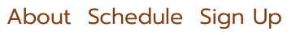
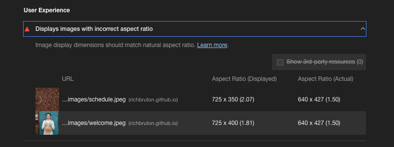

# Maynooth Coffee Club

This website is aimed at professional and amateur baristas, as well as coffee enthusiasts. It is for people who wish to both improve their skills and techniques and those who wish to share their ideas and recipes. 

The website will inform them of monthly meetups where they can share ideas, each meetup will have a theme in different areas of coffee preparation. There will be a competition or challenge in the final meet up of each month. 

# User Stories

## First time user

A first time user is a person who has taken interest in making a higher level of coffee at home, perhaps after buying new equipment, who is looking to learn new skills but isn't sure where to start. Another first time user is somebody who is keen to upskill in order to get a job in a cafe as a barista. Both types of user have an interest in learning more about different brewing techniques and to meet other people with similar interests.

## Returning user

The returning user has already learnt about the group and is keen to attend meetings, their primary goal is to see when and where meetings are taking place and what topics are being covered. They will also want to be able to inform the organisers which events they can attend. 

## Site owners

In this case the site owners are a group of cafe owners in a medium sized town. After a year or more restrictions they are face with many challenges. A lot of their customers have both home brewing equipment, they want to connect with these customers so that they return. They may not return as frequently for a cup of coffee but they can buy their beans from the local cafes.

Another challenge faced by the cafe owners is that they are struggling to hire staff. These meetings can act as informal training sessions for anybody who is looking to gt a job in a cafe, it will give them a chance to improve their skills and to meet potential future employers.

# Design

This website is design around blocks. Two large screen width blocks sitting over four half screen width blocks.

As screen size gets narrower, the smaller blocks will go form side by side to on below one another.

# Features

The websites feature include; a header with a logo and a navigation bar, a landing image, a briet introduction to the site, a schedule of events, a form to sign up to events and a footer that contains links to social media platforms.

## Navigation bar

The navigation bar sits in the header floated to the right of the logo, as the screen gest smaller it drops below the logo and the font size gets slightly smaller on the smaller screens. The menu allows the user to quikly jump down to a particular section. It will mostly be for returning users who are interested in going straight to that month's schedule or sign up form.

## About Section

The about section sits below the landing image. It is a brief introduction to the site and the purpose of the site. It lets first time visitors know what to expect and to remind returning visitors that they can give back to the group by sharing their knowledge. 

It has a margin on either side to prevent the content looking stringy on a wide screen but as the screen sizes down this margin disappears.

## Meeting Schedule

The meeting schedule, is a table that displays the time, date, location and topic for meetings for the next month. The site currently displays the meetings for February. This will require manual updating each month. 

There is a link to the sign up form that is only visible on smaller devices, as the form can still be hidden at this point.

## Sign up form

The sign up form contains a required first name, a required second name, a required email address, and a radio type selection of events. Initially it was to be a checkbox set of options but that proved difficult to create a required attribute for it using only HTML and CSS. This is something that will be improved on after the site goes live.

## Footer

The footer contains logos of the social media sites, and each one links to the account of the Maynooth Coffee Club for that social media site. On smaller sized devices, the footer is static, this is due to a bug where the logos and links would remain at the bottom of the page and appear invisible against a blank background and the brown background would jump up the page.

## Future features

After a few events have taken place, there will be scope to build a gallery. The gallery will focus on people at the events and the coffees created at the events. 

# Bugs

Initially the plan was to run a form that had series of checkboxes that were required to fill out, so that a user could submit to attend a number of combinations of events. Upon research, it was learnt that to have `required` as an attribute wasn't possible using only HTML and CSS. Javascript would be required to implement such a feature in the form. As a work around, Radio type inputs were used instead of checkboxes. While only one option can be chosen now, it is required. Users can return to the site to sign up to subesquent events to declare their intentions at one of the meetings.

# Testing

The site's HTML code was run through the W3C HTML Validator. It returned zero errors.

The site's CSS code was run through the W3C CSS Validator. It returned zero errors.

In developer tools in Google Chrome, a lighthouse report was generated. This returned a favourable result.

It did suggest that there is room to improve on image aspect ratios. This is something that can be improved on with great understanding of CSS.

# Manual Testing

Further testing was completed on a laptop, an ipad and an iphone using Chrome, Safari and Edge. The reuqired parts of the form all work as intended. Since it is a dummy form the JOIN NOW button brings the user to a "Thank you for signing up" page that contains a link back to the index.

## First time user

When using the site, the first time user is greeted with an image of a cup of coffee that in in keeping with the colours used on the site. The about section explains the purpose of the group, that it is social and about upskilling. There is also a chance to show others the skills you have picked up on the way. 

On desktop, the top of the schedule is visible to encourage them to scroll down. On mobile, the navigation bar has a clear link to the section with the schedule and another to the sign up form.

## Returning user

The returning user has already learnt about the site so when they return they are looking for exact information. The link to the schedule and to the sign up form is their target. These links are visibile on desktop as soon as they land on the page. If they are on desktop and are looking at the schedule, they can see the top of the sign up form. This will encourage them to scroll down. 

If they are using a mobile screen and the form is not visibile from teh schedule section a link appears to bring them down to that section. This link does not appear on larger screens.

# Deployment

## The site was deployed on github pages. The deployment process was

1. Open the project in Github

2. Click on settings and navigate to pages.

3. Select branch : Main.

4. Click save.

## To run locally, the deployment process is

1. Navigate to the site's [repository](https://github.com/richbruton/html-css-essentials)

2. Click on the code button.

3. Copy the URL under Clone with HTTPS by clicking on the copy button.

4. Open the terminal in your IDE, and navigate to the directory intended for use.

5. Type `git clone` into the terminal followed but the copied url link form Step 3. It should look like this `git clone https://github.com/richbruton/html-css-essentials.git`

6. Press enter to clone the repository.

# Credits

Photos came from [pexels.com](https://www.pexels.com/)

Fonts were taken from [Google Fonts](https://fonts.google.com/)

The coffee cup icons and social media icons came from [Font Awesome](https://fontawesome.com/)

# Acknowledgements

A big thank you to Jack Wachira, for all of his input throughout this project.